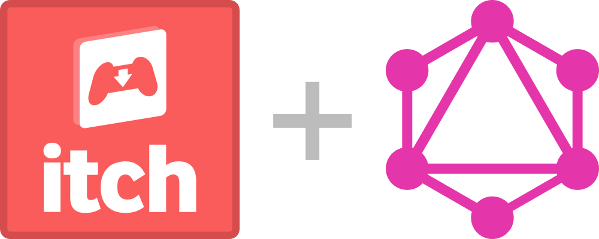

# itch-graphql
[](https://app.buddy.works/grahambarber/itch-graphql-1/pipelines/pipeline/134863) [](https://codeclimate.com/github/puregarlic/itch-graphql/maintainability) [](https://www.npmjs.com/package/npm) [](http://makeapullrequest.com) [](https://github.com/your/your-project/blob/master/LICENSE)
> GraphQL server and typedefs/resolvers for the itch.io API.

If you've ever wanted a GraphQL wrapper around the itch.io REST API, you've come to the right place. I know this is pretty niche, but at least you have the option now.

- [x] Export a built-in server
- [x] Export typedefs and resolvers
- [x] API key support
- [ ] JWT support
- [ ] NPM command
- [ ] Socially acceptable tests

## Installing / Getting started

First, you have to install it to the project:

```shell
# with NPM
npm install itch-graphql

# with yarn
yarn add itch-graphql
```

From here, there are (currently) two ways that you can use this package: Either as a standalone server, or by importing the types/resolvers and integrating them with your own server.

We'll assume you're using an ESM-supported environment for the purposes of this README, but if you're confused, just know that 

```js
import { server } from 'itch-graphql'
```
is the same thing as
```js
const { server } = require('itch-graphql')
```

### Standalone

This is pretty simple. All you need to do is import the server and call it with the port and a boolean for GraphiQL. Internally, it's using `micro`, `apollo-server-micro`, and `microrouter`.

```js
import { server } from 'itch-graphql'

server(
  // Port number
  3000,
  // GraphiQL boolean, defaults to true
  false
)
```

Open up GraphQL Playground to `http://localhost:3000/graphql` or your web browser of choice to `http://localhost:3000/graphiql` and you're ready to play around.

### Integrating with your own server

This is a little bit more in-depth, but not too terrible.

```js
// import and alias our types and resolvers for readability
import { typeDefs as itchTypes, resolvers as itchResolvers } from 'itch-graphql'
import { makeExecutableSchema } from 'graphql-tools'
import { graphqlExpress } from 'apollo-server-express'
import express from 'express'

// Stitch together the schema of legends
const schema = makeExecutableSchema({
  typeDefs: [
    someType,
    moreType,
    ...itchTypes
  ],
  resolvers: {
    ...someResolvers,
    ...moreResolvers,
    ...itchResolvers
  }
})

// Assemble the GraphQL handler
const graphqlHandler = expressGraphql((req, res) => {
  return {
    schema,
    // Add our Itch token for authorization
    context: {
      // You can set this up however you like, as long as this property ultimately says `Bearer <token>`
      authorization:
        req.headers.authorization || `Bearer ${process.env.ITCH_TOKEN}`
    }
  }
})

// Start the app
const app = express()
app.get('/graphql', graphqlHandler)
app.listen(3000)
```

And you're golden!

## Developing

### Built With
+ [esm](https://www.npmjs.com/package/esm)
+ [graphql-tools](https://www.npmjs.com/package/graphql-tools)
+ [popsicle](https://www.npmjs.com/package/popsicle)
+ [micro](https://www.npmjs.com/package/micro)
+ [microrouter](https://www.npmjs.com/package/microrouter)
+ [apollo-server-micro](https://www.npmjs.com/package/apollo-server-micro)
+ [ava](https://www.npmjs.com/package/ava)

### Prerequisites

In order to get started developing, you're going to need a version of Node installed (preferably the latest release), and an itch.io token. You can create the token from your profile on the website.

### Setting up Dev

If you're interested in contributing, it's pretty simple to get started locally:

```shell
git clone https://github.com/puregarlic/itch-graphql
cd itch-graphql/
npm install
npm run dev
```

And you're good to go. We recommend using [GraphQL Playground](https://github.com/graphcool/graphql-playground) to test the API, because you can pass HTTP Headers from the application. GraphiQL is only great if you're handing the token to context from your server; the shipped server currently prefers the token from an `"Authorization": "Bearer <your token here>"` header.

If you make any changes to the source code, the server will autoreload thanks to [nodemon](https://www.npmjs.com/package/nodemon).

### Deploying / Publishing
Publishing happens automatically via [semantic-release](https://www.npmjs.com/package/semantic-release), deployed with [Buddy](https://buddy.works).

The main thing to know is that we use [commitlint](https://www.npmjs.com/package/@commitlint/cli) to enforce conventional commits. __These are very important for correctly generating changelogs and creating new versions.__

If you need to know more about how to write conventional commits, check out [the spec](https://conventionalcommits.org), and if you need to know the different allowed types, check out [this JSON file](https://github.com/commitizen/conventional-commit-types/blob/master/index.json).

## Tests

> My current tests are absolutely horrible. If you can write better ones, or simply want to improve my existing ones, please _please_ ___please___ make a PR. 

If you want to run the tests locally, you're going to need a `.env` file in the project root. This needs to contain a few values:

```env
# <REQUIRED> Itch API Token
ITCH_TOKEN=

# <REQUIRED> User ID number. You can retrieve this with the me query
USER_ID=

# You need one of these two, for the purchases and download key query:
GAME_ID=
EMAIL=

# You can add this if you really want:
DOWNLOAD_KEY=
```

My user account is downright lacking when it comes to test data, so if you're willing to donate an API token for the testing environment, please get in touch with me on Twitter.

## Style guide

This project follows the [Standard](https://www.npmjs.com/package/standard) style, so if you want to install an editor linter for that, go right ahead. However, it's not really necessary -- Each time you commit, we'll lint your staged changes with the `--fix` flag, and then format it all with [prettier-standard](https://www.npmjs.com/package/prettier-standard). As a result, you don't need to worry about styling too much, because it'll be fixed later.

## Api Reference

Since this is a wrapper around the Itch server-side API, you can read the docs [here](https://itch.io/docs/api/serverside).

## Legal

I'm not affiliated with itch.io in any capacity, and the images used in the project logo are the property of their respective owners. 